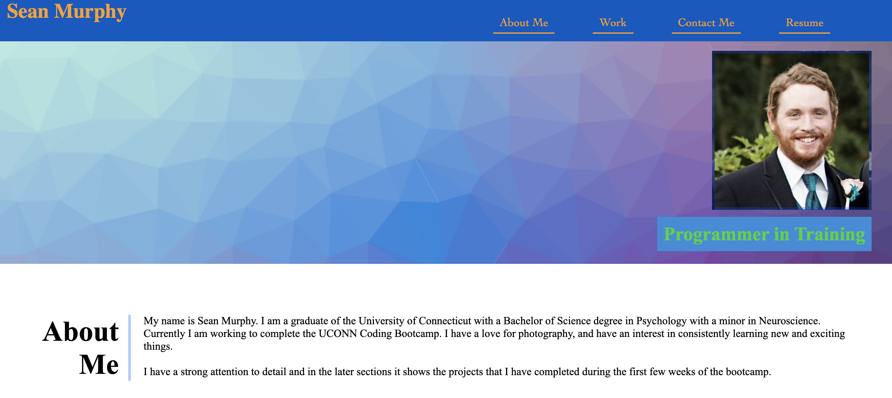
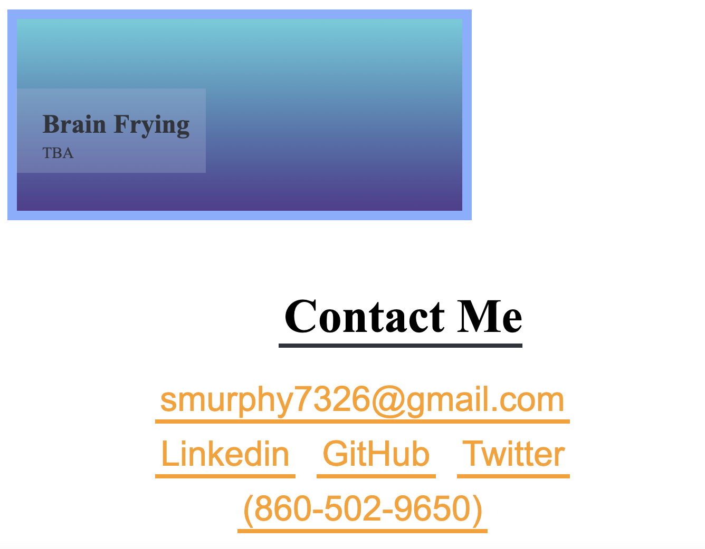

# UCONN Coding Bootcamp Module Two CSS Professional Portfolio

## Purpose

UCONN Coding Bootcamp asked us to make a portfolio that will be used for the class as well as for future job prospects. WE are to make a portfolio with the projects that we have made so far, with the skills we have learned so far. Adding to this portfolio in the future will allow us to show our progress as well as employers to see the work that we have done and the different techniques we have learned throughout the bootcamp. 

### Version 1 - First Commit

### Version 1.1 - Header Section
* Made the header section with a few links to place hold for later

### Version 1.2 - README.md 
* Made the README.md to track the progress of the page
* Made a small Hero Section 
* Outlined an About me section

### Version 1.3 - Work Styling
* Added Work Styling
* Bare Bones style.css
* had to adjust work styling in order to make it make sense

### Version 1.4 - Working on About me
* Added a few things to the general HTML on top
* tried to put an profile picture in but took it out
* Added to the About Me Section
* Worked on the projects section for an understanding

### Version 1.5 - Index Work Section
* Worked on the index Section
* Added General Notes about the projects
* Added 5 layouts for projects to be adjusted later

### Version 1.6 - Working on HTML
* Changed the footer section for different links
* Got rid of some code in the project section that would not work

### Version 1.7 - Adjusting Header
* Adjusted the nav bar to take into about the listing parts
* Got rid of some general notes

### Version 1.8 - About Me
* The hero section had to be changed around for when you compressed the webpage
* The About Me section adjusted for a shrinking webpage

### Version 1.9 - Moved Header
* Played around with the margins so the webpage would look more streamline
* Changed the hero background image
* Added more things for the hero section and sub hero sections

### Version 1.10 - Working on Projects
* Worked on the projects section to make it flow better
* Made the projects section better more personal with links to projects

### Version 1.11 - About Me Final
* Adjusted the margins in the About Me Section
* Adjusted the flow of the About Me Section
* Adjusted the settings of different parts of the About Me Section for better reactions to smaller screens

### Version 1.12 - Projects Section
* Adjusted text so everything was uniform throughout the page
* Changed colors to make borders and boxes the same color
* Inserted photos for last few projects so it is not bare

### Version 1.13 - Links Working
* Ajusted the header section to make sure all the links worked

### Version 1.14 - Fake Repositories
* Made fake repositories to get a link when clicking on projects

### Version 1.15 - Smaller Screen Changes
* Added photo back to the header
* Adjusted values for spacing
* Added values for smaller screen
* Adjusted margins for the smaller screens

### Version 1.16 - README.md and screenshots
* Updated the README file
* Added photos to CSS folder
* Added screenshots in the README

### Version 1.17 - First Picture
* Adjusted the first picture to make it work

### Version 1.18 - README
* Updated the top of the READme
* Added a link to the deployed application

[Portfolio Page](https://smurphy7326.github.io/CSS-Professional-Portfolio/)

